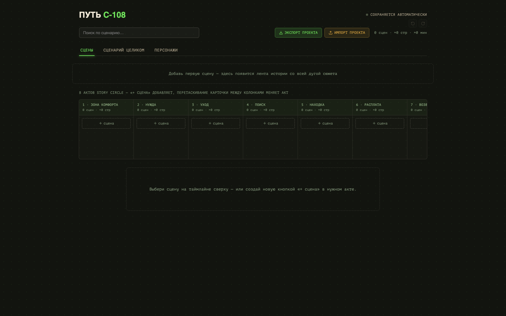

# c-108: Сценарная доска (Story Circle Board) 🔷 [Beta]

> Интерактивный сценарный бит-шит и редактор историй по 8-частному кругу Дэна Хармона с визуальной кривой эмоционального накала и картотекой персонажей.

**[▶ Open in browser — try it now](https://lexbayart.github.io/c-108/)**
No install. No account. Works offline.

---

## 🔷 What makes this different

Большинство сценарных программ заставляют писать либо в линейном текстовом потоке, либо в плоских канбан-досках, не учитывающих драматическую структуру эпизода.

«c-108» объединяет классический 8-частный круг историй Дэна Хармона (*Dan Harmon's Story Circle*) с интерактивным графиком эмоционального напряжения. Вы не просто раскладываете сцены по актам от «Зоны комфорта» до «Необратимого изменения», но и управляете кривой драматического накала каждой сцены на живом сплайне с маркерами кульминаций.

Блочный редактор поддерживает профессиональную сквозную клавиатурную раскладку (Enter переводит имя персонажа в реплику, Tab вставляет ремарку, Enter из реплики переходит в действие). Каждое имя подтягивает персональное досье (цель, скрытая тайна, речевой голос) и автоматически считает баланс экранного времени и реплик.

Все данные хранятся прямо в вашем браузере. Никаких серверов, регистраций или подписок — полностью автономный инструмент в одном HTML-файле.

---

## ✨ Features

- ⭕ **8 этапов круга историй Хармона** — структурирование эпизода от «Зоны комфорта» до «Изменения» с drag-and-drop перемещением сцен
- 📈 **Кривая эмоционального накала (Лента)** — интерактивный SVG-сплайн с перетаскиванием уровня напряжения (0–100) и цветной градуировкой
- ⭐ **Маркеры кульминаций (Milestones)** — выделение ключевых поворотных точек сюжета в один клик
- ✍️ **Блочный сценарный редактор** — блоки «Действие», «Персонаж», «Ремарка», «Реплика», «Переход» с умным автопереходом фокуса
- 👥 **Картотека персонажей с досье** — 6 полей на каждого героя (роль, черта, цель, тайна, манера речи, связи)
- 💬 **Всплывающие подсказки голоса** — наведите мышь на персонажа в тексте, чтобы увидеть его речевые привычки и цели
- 📊 **Аналитика экранного времени** — автоматический подсчёт количества реплик и слов по каждому герою
- 🕸️ **Граф взаимодействия персонажей** — визуализация совместных сцен и парных диалогов
- 🗂️ **Матрица сюжетных линий** — координатная сетка параллельных веток сюжета (A-plot / B-plot)
- 🔍 **Мгновенный полнотекстовый поиск** — поиск по репликам, описаниям и персонажам с быстрым переходом к сцене
- 📄 **Экспорт в стандартный текст** — скачивание готового сценария в формате Fountain-совместимого `.txt`
- 💾 **Полный бэкап проекта** — экспорт и импорт всего проекта со сценами и персонажами в `.json`
- ↩️ **Глубокая история правок** — 150 уровней Undo/Redo (`Ctrl+Z` / `Ctrl+Shift+Z`) с текстовым описанием каждого изменения
- ⚡ **100% офлайн и локальное хранение** — сохранение в `localStorage`, нулевой шаг сборки, нулевые внешние зависимости

---

## 🚀 Open it

**[▶ lexbayart.github.io/c-108](https://lexbayart.github.io/c-108/)**

Or download `index.html` from this repo and open it locally —
fully standalone, works without internet after first load.

---

## 📖 Documentation

- [**Complete User Guide**](docs/GUIDE.md) — tools, hotkeys, all features explained

---

## 🛠️ Tech

- React 18 & ReactDOM (bundled single-file)
- Lucide React icons
- HTML5 Canvas & SVG Dynamic Splines
- Web Storage API (`localStorage`)
- Google Fonts (Unbounded, Manrope, PT Mono)
Single HTML file · Zero dependencies · Zero build step

---

## 💬 Feedback & Contact

This project is in active development.
Found a bug or have an idea? Reach out:

- **Telegram:** [@lexbay](https://t.me/lexbay)
- **GitHub Issues:** [Open an issue](https://github.com/lexbayart/c-108/issues)

---

## 🧪 Dev Notes

`docs/` contains `GUIDE.md` with complete usage instructions and keyboard navigation patterns.

---

## 📄 License

© 2025 lexbayart — [CC BY-NC 4.0](https://creativecommons.org/licenses/by-nc/4.0/)

Free to use and share for non-commercial purposes with credit.
Commercial use requires explicit permission from the author.
